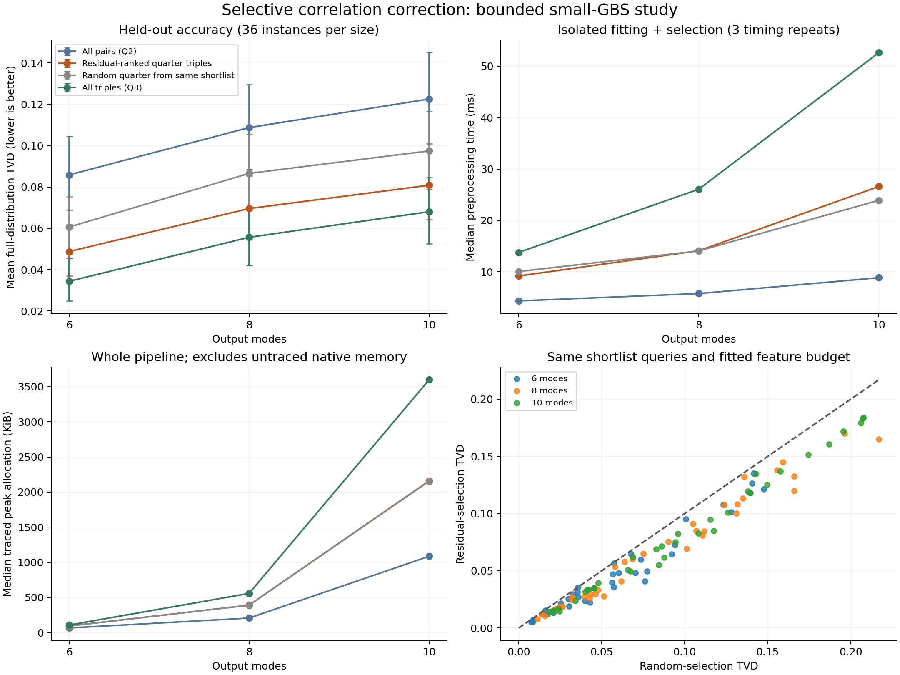

# Selective Correlation Correction for Small Gaussian Boson Sampling Systems

**First research draft — October 2, 2026.** Completed computational first-stage study; manuscript-development material, not a submission-ready paper.

## Abstract

We tested whether selected three-detector dependencies improve a pairwise classical approximation of threshold Gaussian boson sampling (GBS). The predeclared suite contains 144 synthetic optical instances: 36 for development and 108 held out, spanning 6, 8, and 10 output modes, two source fractions, two squeezing values, and three transmissions. A normalized exponential-family model was fitted using exact local Gaussian moments. A residual-based rule, frozen after development, retained one quarter of all triple features after querying one half. Mean held-out full-distribution total variation distance (TVD) fell from 0.10575 for all-pair fitting to 0.06641, a 37.2% reduction. Random selection at the same feature and local-query budgets gave 0.08157; uniform third-order fitting gave 0.05269. Targeted selection preserved 74.1% of the aggregate TVD improvement obtainable by adding every triple. It remained less accurate than uniform third-order fitting on every held-out instance. The study supports selective information allocation at small scale, while its enumerated fitting architecture prevents a scalable-sampler claim.

## 1. Research question and relationship to existing work

The question is which detector groups deserve additional computation when all higher-order dependencies cannot be afforded. Merely showing that lower-order moments do not fix a complete distribution is established background. The testable contribution here is a reproducible comparison of two frozen selection rules with a random control, exact distribution error, and measured costs.

The eventual experimental target is the **Jiuzhang 2.0 threshold-click task**, chosen to connect to a tractable correlation-based reference. Villalonga et al. describe Boltzmann-machine and greedy approximations built from low-order marginals. We implemented the stationary Boltzmann distribution defined by the printed TAP parameter equations, and independent-output sampling. We enumerate those distributions exactly at small scale rather than reproduce their Gibbs chain, implementation speed, or experimental-data analysis. [Villalonga et al.](https://arxiv.org/html/2109.11525)

Dodd et al.'s cumulant-informed chain-rule emulator and Goodman et al.'s phase-space sampler are additional competitors for a future algorithmic claim; neither was implemented in this draft. Jiuzhang 4.0 provides a later, different experimental target. The present result does not measure any of these methods' errors or overturn their claims. [Dodd et al.](https://arxiv.org/html/2511.14923), [Goodman et al.](https://arxiv.org/html/2604.12330), [Jiuzhang 4.0](https://arxiv.org/html/2508.09092)

This is an initial nearest-literature check, not a completed systematic novelty review. No Strikeout List was found in this research vault. Selective feature fitting is not claimed as a new general statistical idea.

## 2. Optical model and locked study design

Each instance starts with independent single-mode squeezed vacuum inputs, a seeded Haar-random complex interferometer, uniform optical transmission, and ideal threshold detection. Modes $M\in\{6,8,10\}$, source fraction $f\in\{0.5,1\}$, squeezing $r\in\{0.4,0.8\}$, and transmission $\eta\in\{0.4,0.7,0.95\}$ form 36 cells. Active sources occupy the first $fM$ inputs. Each cell has one development interferometer and three independent held-out interferometers. No distinguishability, thermalization, dark counts, hardware calibration, or click-number conditioning enters model fitting.

With quadrature vacuum variance $1/2$, the covariance is

$$V=\eta S(U)V_{\mathrm{in}}S(U)^T+(1-\eta)I/2,$$

where $V_{\mathrm{in}}=\operatorname{diag}(e^{-2r_i}/2,e^{2r_i}/2)$ in all-position/all-momentum ordering. Vacuum probabilities of small mode subsets are computed from $\det(V_A+I/2)^{-1/2}$. Complete threshold-click probabilities are obtained by inclusion–exclusion only after all candidate models have been finalized. Exact threshold detection is the relevant physical reference formalism. [Quesada, Arrazola, and Killoran](https://arxiv.org/abs/1807.01639)

The protocol was saved before results, with SHA-256 `e608ed15857c65fa210357cfae3b3c9b22c6cdd0b345eb0c32d5f815c91715cc`. Interferometer seeds, physical parameters, optimizer settings, failure rules, budgets, and endpoints are retained in `protocol.json` and `results.json`. Development selected the residual rule by lower mean TVD (0.06552 versus 0.06985); `frozen_selection.json` records that choice before the held-out stage. Held-out full probabilities never supply fitting targets or feature rankings.

## 3. Selective correction architecture

Let $s_i=2x_i-1$ and $F_S(x)=\prod_{i\in S}s_i$. For a feature set $\mathcal F$, we fit

$$Q_{\mathcal F}(x)=Z^{-1}\exp\left(\sum_{S\in\mathcal F}\theta_S F_S(x)\right).$$

All one-mode and pair features are retained. L-BFGS-B matches their targets and the selected triple targets using an explicitly summed partition function. Thus $Q$ is nonnegative and normalized, and can generate independent samples from its stored cumulative probability table. The $2^M$ enumeration is intentional for diagnosis and is the principal scaling limitation.

**Pair rule:** rank every triple by the sum of absolute normalized pair covariances within it; retain the top quarter. **Residual rule:** shortlist the top half using that pair score, calculate their local triple targets, and retain a quarter of all triples using $|\langle F_S\rangle_P-\langle F_S\rangle_{Q_2}|/\sqrt{\max(1-\langle F_S\rangle_{Q_2}^2,10^{-12})}$. Local targets use small-subsystem determinants; the prediction uses the fitted pairwise model. **Random control:** query the identical shortlist, then retain a randomly chosen quarter of all triples from it. The random control matches local-query and fitted-feature budgets; measured wall time and memory are evaluated separately. **Uniform comparator:** retain all triples. All corrected models start from the pairwise fit and pay for that fit.

| Modes | Pair features | Selected triple features | Queried residual/random triples | Uniform triple features |
|---:|---:|---:|---:|---:|
| 6 | 21 | 5 | 10 | 20 |
| 8 | 36 | 14 | 28 | 56 |
| 10 | 55 | 30 | 60 | 120 |

Candidate ranking interactions remain possible: a large individual residual is a heuristic, not an exact additive prediction of TVD improvement. We did not use an oracle full-TVD ranking or exhaustively optimize combinations.

## 4. Held-out results

| Method | Cases | Mean full TVD | Mean click-count TVD | Strict gate failures |
|---|---:|---:|---:|---:|
| Independent | 108 | 0.22025 | 0.17373 | 0 |
| Printed TAP stationary model | 84 | 0.11727 | 0.10122 | 24 |
| All pairs (Q2) | 108 | 0.10575 | 0.08476 | 0 |
| Pair-ranked quarter triples | 108 | 0.06994 | 0.05227 | 1 |
| Residual-ranked quarter triples | 108 | 0.06641 | 0.04997 | 0 |
| Random quarter from same shortlist | 108 | 0.08157 | 0.06012 | 0 |
| All triples (Q3) | 108 | 0.05269 | 0.04123 | 2 |

The TAP mean uses only its 84 supported cases and must not be compared directly with 108-case means as though the populations matched. Negative square-root discriminants made the printed approximation unsupported in 24 held-out instances. This is an applicability boundary in this implementation and synthetic grid, not a disproof of the published experiment. Its table sampler also does not reproduce the paper's Gibbs runtime.

| Comparator | Mean TVD reduction by residual rule | Descriptive paired 95% interval | Wins / ties / losses |
|---|---:|---|---|
| All pairs (Q2) | 0.03933 | [0.03574, 0.04310] | 108 / 0 / 0 |
| Pair-ranked quarter triples | 0.00352 | [0.00280, 0.00428] | 91 / 10 / 7 |
| Random quarter from same shortlist | 0.01515 | [0.01321, 0.01710] | 107 / 1 / 0 |
| All triples (Q3) | -0.01372 | [-0.01515, -0.01237] | 0 / 0 / 108 |

The residual rule improves on the pairwise model in all 108 cases, and on random selection in 107 with one numerical tie. It loses to uniform third-order fitting in all 108. The ratio of aggregate mean improvements retained is 74.1%; a mean of per-instance retained fractions is a different statistic. Bootstrap intervals use 2,000 paired resamples and describe this heterogeneous synthetic suite; they do not establish transfer to hardware or larger mode counts.

## 5. Computing costs and the success criterion

| Method | Median preprocessing (ms) | Median traced peak (KiB) | Median iid table sampling, 100k shots (ms) |
|---|---:|---:|---:|
| All pairs (Q2) | 5.54 | 206.5 | 1.71 |
| Residual-ranked quarter triples | 13.53 | 390.7 | 1.70 |
| Random quarter from same shortlist | 13.60 | 389.2 | 1.69 |
| All triples (Q3) | 23.67 | 557.5 | 1.69 |

Timing was repeated three times per held-out case in randomized method order with one numerical-library thread. The covariance is given to each pipeline. Costs include local targets, pair fitting, shortlisting, residual calculations, and correction fitting; they exclude exact full-reference generation and evaluation. Memory is an isolated whole-pipeline traced allocation peak, not total process RSS or GPU memory. All methods retain exponentially sized tables, so their small-system iid sampling speeds are not evidence of scalability.

The median within-instance residual-to-uniform preprocessing ratio is 0.602, and its traced-memory ratio is 0.701. Its residual-to-random time ratio is 1.021. These are medians of paired ratios, not ratios of the summary-table medians. Under the predeclared strict gate of lower TVD with no greater preprocessing time and traced memory, residual selection dominates the pairwise and uniform comparators in **0 and 0 of 108 cases**, respectively. Against the random control, strict dominance occurs in 12 cases; lower TVD with no greater time occurs in 46.

**Interpretation:** selected triples buy a substantial fraction of third-order accuracy with fewer features and lower measured cost than uniform fitting, but do not establish a general same-accuracy/lower-cost replacement for a published sampler. They cost additional computation relative to Q2. A cheaper intermediate approximation and a strict Pareto improvement over the baseline are different findings.

The first run's `traced_peak_bytes` adds stage allocation peaks and is a conservative proxy, not a true simultaneous high-water mark. This was caught during audit. All memory conclusions above use `cost_audit.json`, which measures an isolated pipeline end to end. `preprocessing_seconds` in the first run is instrumented; the table above uses the repeated untraced audit. Both records are retained.

## 6. Validation, failures, and what summary scores miss

All 144 exact distributions passed probability checks. Analytic vacuum, zero-transmission, and independent squeezed-input checks passed; the largest local-vs-full spin-moment discrepancy was 7.66e-15. Photon-expectation conservation and output-mode permutation checks passed. A full-order four-mode fit recovered its reference with TVD 2.14e-08. Isolated pipeline rebuilds reproduced stored probabilities to maximum error 0.00e+00.

Every residual-selected held-out fit passed the strict convergence/tolerance gate. One pair-selected fit and two uniform fits ended with an abnormal line-search status even though their maximum matched-moment errors were below $10^{-6}$. They remain in the main tables and are flagged in raw results. Excluding all three affected cases leaves 105 cases and the same method ordering (Q2 0.10676; residual 0.06701; uniform 0.05350). No failed case was silently discarded or replaced.

Across non-tied comparisons among the five core models, click-count TVD reversed the full-TVD ranking in 21 of 1069 comparisons. Third-order click-cumulant RMS reversed it in 9 of 1069. These comparisons share instances and are descriptive counts, not independent significance tests. For example, `heldout_m6_f0.5_r0.8_eta0.7_rep2` ranks Residual-ranked quarter triples and All triples (Q3) differently: full TVD is 0.04068 versus 0.03650, while click-count TVD is 0.03200 versus 0.03427. This is a diagnostic reversal on a synthetic instance, not an assessment of a published experimental conclusion.

The raw results also retain spin-moment RMS through order four, click-cumulant RMS at orders three/four, and conditional TVD in every click sector whose target mass is at least 1%. Conditional sector scores do not replace the primary unconditional endpoint. Each method generated 100,000 iid table samples three times; sample-to-model discrepancies validate the generator separately from approximation error to the physical target.

## 7. Where this sits in the complete project

| Stage from the project description | Current status | Remaining evidence |
|---|---|---|
| Define target and published comparison | First choices made | Obtain calibration/samples for Jiuzhang 2.0; verify an authors' implementation |
| Specify selection rules and normalized architecture | Implemented and tested | Replace full enumeration with a practical fitting/sampling method |
| Expand exact cases and lock held-out evaluation | Completed first grid: 144 cases | New locked circuit families, larger sizes, additional noise mechanisms |
| Test selective corrections against uniform order | Completed at 6–10 modes | Matched accuracy targets and time/memory budgets; stronger published comparators |
| Revise the scientific claim from measured results | Completed | Establish novelty and robustness before a submission claim |
| Experimental benchmark and scaling | Not completed | Same calibration, observations, conditioning and validation tests as hardware |
| Publishable contribution | Not established | New method or substantive validation finding beyond known truncation limitations |

We have moved from a nine-instance feasibility probe to a completed first selective-correction benchmark. The full project is still in **small-system algorithm validation**, before scalable algorithm and experimental benchmarking. An overall percent-complete estimate would be misleading because the later algorithmic contribution depends on whether the evidence survives those stages.

## 8. Does a paper require a better algorithm or an analysis of existing papers?

There are two defensible publication routes. **An algorithm paper** needs a specified new method, convincing novelty, and a reproducible accuracy–cost advantage over strong named alternatives on matched tasks. “Better” must mean the same accuracy for less time/memory, or better accuracy within the same measured budget. The current result motivates this route but does not complete it: our solver enumerates every bit string and no Dodd, tensor-network, or phase-space implementation has been beaten.

**A benchmarking/validation paper** can succeed without a superior simulator if it contributes a new, robust finding about a validation metric, a failure regime, a calibration mismatch, or a resource estimate. It would require faithful reproductions and stronger evidence than simply restating papers or confirming that low-order statistics are incomplete. Our ranking reversals and selective-versus-random result are starting findings, not established novelty or experimental refutations.

**Decision:** continue the selective-allocation idea, but do not prepare a submission claiming improved large-scale classical GBS simulation yet. The next decisive step is to port the selection into a method that does not enumerate $2^M$ outcomes, establish fitting/sampling reliability, and compare with at least a faithful cumulant-chain-rule implementation. Reproducing a published implementation and analyzing its results are necessary groundwork; a new algorithm or a new substantiated scientific finding supplies the paper's contribution.

Before extending to the hardware benchmark: (1) complete the nearest-literature and code audit; (2) freeze a second grid including new circuit structures and noise settings; (3) test multiple selection budgets with training separated from evaluation; (4) compare at fixed declared TVD thresholds on exact cases, including full costs and mixing checks if MCMC is used; (5) move to calibrated experimental subsystems and the same published validation tests only after the scalable architecture passes. A failure at stages 2–4 should narrow the claim or trigger a documented pivot to validation analysis, not be hidden.

## 9. Reproducible artifacts

The implementation is `work/gbs_selective_correction_study.py`; isolated cost measurement is `work/gbs_selective_cost_audit.py`; this report is generated by `work/gbs_selective_report.py`. `outputs/selective_correction_v1/` contains the protocol, frozen rule, every per-case result, cost audit, environment and source hashes, verification results, summary, figure PNG/PDF, and 144 compressed optical/probability artifacts. See [the reproduction instructions](work/SELECTIVE_STUDY_README.md).

## Appendix: every predeclared held-out cell

Each entry averages its three independent interferometers. No unfavorable cell is omitted. All per-instance and conditional-sector data remain in the raw artifacts.

| Modes | Source fraction | r | Transmission | Q2 TVD | Pair-selected | Residual-selected | Random-selected | Q3 TVD |
|---:|---:|---:|---:|---:|---:|---:|---:|---:|
| 6 | 0.5 | 0.4 | 0.4 | 0.01343 | 0.00668 | 0.00597 | 0.00827 | 0.00133 |
| 6 | 0.5 | 0.4 | 0.7 | 0.05591 | 0.02924 | 0.02578 | 0.03936 | 0.01374 |
| 6 | 0.5 | 0.4 | 0.95 | 0.10177 | 0.06530 | 0.05694 | 0.07559 | 0.03228 |
| 6 | 0.5 | 0.8 | 0.4 | 0.03904 | 0.01837 | 0.01782 | 0.02108 | 0.00886 |
| 6 | 0.5 | 0.8 | 0.7 | 0.09406 | 0.04593 | 0.03869 | 0.05590 | 0.03408 |
| 6 | 0.5 | 0.8 | 0.95 | 0.16890 | 0.11949 | 0.11055 | 0.12336 | 0.07991 |
| 6 | 1.0 | 0.4 | 0.4 | 0.02499 | 0.01452 | 0.01259 | 0.01758 | 0.00425 |
| 6 | 1.0 | 0.4 | 0.7 | 0.08739 | 0.04064 | 0.03705 | 0.05111 | 0.02263 |
| 6 | 1.0 | 0.4 | 0.95 | 0.13656 | 0.08738 | 0.08803 | 0.10074 | 0.06259 |
| 6 | 1.0 | 0.8 | 0.4 | 0.04451 | 0.02443 | 0.02466 | 0.03093 | 0.01421 |
| 6 | 1.0 | 0.8 | 0.7 | 0.08582 | 0.05253 | 0.05161 | 0.06678 | 0.03935 |
| 6 | 1.0 | 0.8 | 0.95 | 0.17836 | 0.12296 | 0.11573 | 0.13685 | 0.09923 |
| 8 | 0.5 | 0.4 | 0.4 | 0.02040 | 0.01109 | 0.01018 | 0.01365 | 0.00356 |
| 8 | 0.5 | 0.4 | 0.7 | 0.06836 | 0.03782 | 0.03388 | 0.05354 | 0.02116 |
| 8 | 0.5 | 0.4 | 0.95 | 0.15438 | 0.10559 | 0.09772 | 0.12474 | 0.07599 |
| 8 | 0.5 | 0.8 | 0.4 | 0.05654 | 0.03166 | 0.02598 | 0.03814 | 0.01835 |
| 8 | 0.5 | 0.8 | 0.7 | 0.13129 | 0.08260 | 0.07825 | 0.10623 | 0.05892 |
| 8 | 0.5 | 0.8 | 0.95 | 0.21703 | 0.15721 | 0.14950 | 0.18277 | 0.12983 |
| 8 | 1.0 | 0.4 | 0.4 | 0.03501 | 0.01883 | 0.01782 | 0.02417 | 0.00857 |
| 8 | 1.0 | 0.4 | 0.7 | 0.09584 | 0.06082 | 0.05888 | 0.06555 | 0.04073 |
| 8 | 1.0 | 0.4 | 0.95 | 0.18961 | 0.12594 | 0.12418 | 0.14186 | 0.10121 |
| 8 | 1.0 | 0.8 | 0.4 | 0.05383 | 0.02868 | 0.02866 | 0.04047 | 0.02039 |
| 8 | 1.0 | 0.8 | 0.7 | 0.10562 | 0.07710 | 0.07557 | 0.08788 | 0.06477 |
| 8 | 1.0 | 0.8 | 0.95 | 0.17726 | 0.13737 | 0.13444 | 0.16018 | 0.12446 |
| 10 | 0.5 | 0.4 | 0.4 | 0.03129 | 0.01584 | 0.01470 | 0.01990 | 0.00672 |
| 10 | 0.5 | 0.4 | 0.7 | 0.09761 | 0.05394 | 0.05173 | 0.07238 | 0.03665 |
| 10 | 0.5 | 0.4 | 0.95 | 0.17766 | 0.12152 | 0.11465 | 0.13825 | 0.09262 |
| 10 | 0.5 | 0.8 | 0.4 | 0.06411 | 0.04112 | 0.03585 | 0.04487 | 0.02492 |
| 10 | 0.5 | 0.8 | 0.7 | 0.13770 | 0.09275 | 0.08751 | 0.11365 | 0.07306 |
| 10 | 0.5 | 0.8 | 0.95 | 0.22635 | 0.17141 | 0.16132 | 0.18564 | 0.14418 |
| 10 | 1.0 | 0.4 | 0.4 | 0.04121 | 0.01964 | 0.01845 | 0.02751 | 0.01097 |
| 10 | 1.0 | 0.4 | 0.7 | 0.11391 | 0.06988 | 0.06717 | 0.08550 | 0.05279 |
| 10 | 1.0 | 0.4 | 0.95 | 0.25208 | 0.18585 | 0.18221 | 0.20693 | 0.15894 |
| 10 | 1.0 | 0.8 | 0.4 | 0.05850 | 0.03389 | 0.03329 | 0.04253 | 0.02667 |
| 10 | 1.0 | 0.8 | 0.7 | 0.10513 | 0.07642 | 0.07311 | 0.08629 | 0.06759 |
| 10 | 1.0 | 0.8 | 0.95 | 0.16549 | 0.13336 | 0.13046 | 0.14624 | 0.12139 |

